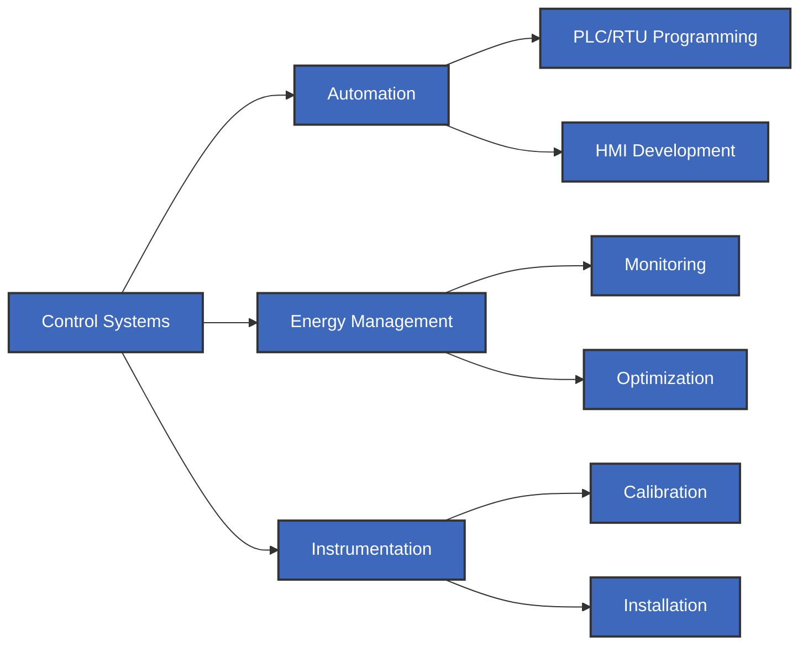

# Mekanet Energy

## About Us

Mekanet Energy specializes in control systems and industrial automation solutions. Our comprehensive suite of services ensures optimal performance and efficiency for your industrial operations.

## Our Solutions Flow

## Core Services

| Service Category      | Key Features                                                             | Benefits                                                               |
| --------------------- | ------------------------------------------------------------------------ | ---------------------------------------------------------------------- |
| Industrial Automation | • PLC/RTU Programming • HMI Programming • Control Panel Design     | • Enhanced Efficiency • Process Optimization • Real-time Control |
| Energy Management     | • Consumption Monitoring • Usage Analysis • Optimization Solutions | • Cost Reduction • Better Traceability • Resource Optimization   |
| Instrumentation       | • Calibration Control • Installation Services • Commissioning      | • Improved Accuracy • Reliable Operations • Professional Setup   |

## Technical Expertise

- Control System Integration
- PLC & RTU Programming
- HMI Development
- Control Panel Design & Production
- Energy Monitoring Platforms
- Industrial Instrument Calibration

## Get in Touch

📧 **Email**: [info@mekanetenergy.com.tr](mailto:info@mekanetenergy.com.tr)  
📞 **Phone**: [+90 232 472 34 78](tel:+902324723478)  
📍 **Location**: Bornova, Izmir, Turkey  
💼 **LinkedIn**: [company/mekanet-energy-automation](https://www.linkedin.com/company/mekanet-energy-automation/)
